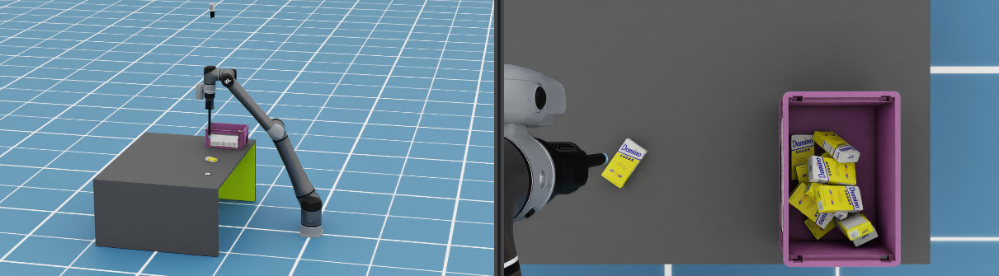

## TM Digital Robot Extension for NVIDIA Omniverse Isaac Sim

## Introduction

**_Important:_** This extension is in **beta testing** and **not for production use**.

TM Digital Robot Extension is a simulation tool that enables developers to control virtual robots using TMSimulation(TMflow). It simplifies robot motion and vision application learning in Isaac Sim's virtual environment, eliminating the need for a physical robot. Pre-built Motion and Vision interfaces handle complex communication between TMRobot and Isaac Sim, streamlining integration tasks.

## Release Notes

Refer to the [Release Notes](RELEASE_NOTES.md) for details.

## Development Prerequisites

-   Basic knowledge of **TMflow programming**.
-   Basic experience of **Python programming**.
-   Familiarity with **Isaac Sim** – it’s helpful to go through the [tutorials](https://docs.omniverse.nvidia.com/isaacsim/latest/introductory_tutorials/tutorial_intro_interface.html) before using the TM Digital Robot Extension.

## Setup Prerequisites

-   TM Simulator(TMflow) 2.22 installed on Windows 10
-   Python 3.10 installed on the PC running Isaac Sim
-   Visual Studio Code and Git installed on the PC running Isaac Sim
-   Ensure the PC running Isaac Sim and TM Simulator are on the same network and using a **wired connection**. A wireless connection is not recommended due to potential instability and delays.

**Notes**:

-   TM Simulator runs on Windows 10 only
-   Isaac Sim runs on Windows or ubuntu, and requires a GPU. Ensure your system meets the [Hardware Requirements](https://docs.omniverse.nvidia.com/isaacsim/latest/installation/requirements.html#system-requirements), the level of "Good" is highly recommended.

## Setup Guide

The TM Digital Robot Extension for Isaac Sim requires the following steps:

-   Step1: Install Isaac Sim 4.2
    -   [For Windows](./docs/INSTALL_WINDOWS.md)
    -   [For Ubuntu](./docs/INSTALL_UBUNTU.md)
-   [Step2: Install TM Digital Robot Extension](./docs/INSTALL_EXTENSION.md)
-   [Step3: Setup TM Simulator](./docs/SETUP_TMSIMULATOR.md)
-   [Step4: Install Cache](./docs/INSTALL_CACHE.md)

## Play with Sample Cases

Run the sample cases to know how simulation works and usage with TM Digital Robot Extension.:

-   [Case 1: Motion Synchronization](./docs/CASE01.md)
-   [Case 2: Digital I/O with Surface Gripper](./docs/CASE02.md)
-   [Case 3: Collaboration accessories](./docs/CASE03.md)
-   [Case 4: FOV Settings of External Camera](./docs/CASE04.md)
-   [Case 5: Understand the Create and Switch Scene](./docs/CASE05.md)

## Troubleshooting

If you encounter issues installing Isaac Sim, refer to the official link below for more information.

-   Detailed installation instructions: [Isaac Sim Python Environment Installation](https://docs.omniverse.nvidia.com/isaacsim/latest/installation/install_python.html).
-   Startup issues: [Isaac Sim Known Issues](https://docs.omniverse.nvidia.com/isaacsim/latest/known_issues.html).

## References

-   [Omniverse IsaacSim Documentation](https://docs.omniverse.nvidia.com/isaacsim/latest/index.html)
-   [Nvidia Developer Forums](https://forums.developer.nvidia.com/)
-   [Nucleus Workstation Installation (Optional)](./docs/INSTALL_NUCLEUS.md)
