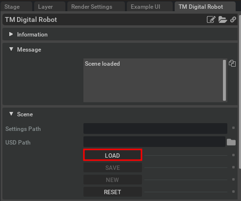

# Case 1: Motion Synchronization

In this case, you will learn how to synchronize the motion between TMSimulator and Isaac Sim using the TM Digital Robot Extension. Please follow the steps below:

## Play sample project in TMSimulator

-   Open the the sample project and click **Play** button.

    

-   Make sure the robot is moving in tab **Simulator**.

    

## Load the sample scene in Isaac Sim

-   Click **LOAD** to open the sample scene.

    

-   Then you will see a default scene with a table.

    

-   Select TM12S from the Model List of Robot01 Settings.

    

-   Then you will see the TM12S robot in the middle of scene, Translate of (0, 0, 0)

    

-   Key in the IP address of the PC running TMSimulator in the **IP** field, then click **START**.

    

-   If the communication is successful, you will see the robot moving in Isaac Sim.

    

## Control the virtual robot by TMSimulator

-   You can now try to control the virtual robot by TMSimulator. Please try click **PAUSE**, **STOP**, **PLAY** and change speed by **+**, **-** to see the virtual robot behavior if it is synchronized with TMSimulator.

    
