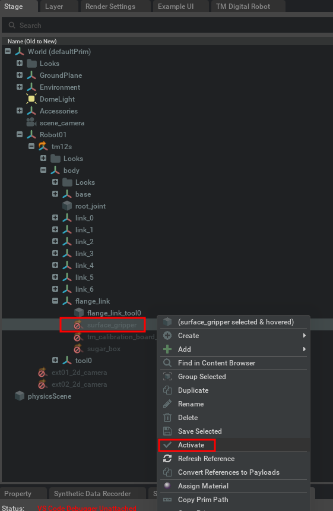

# Case 2: Digital I/O with Surface Gripper

In this case, you will learn how to control the digital I/O with a surface gripper using the TM Digital Robot Extension. Please follow the steps below:

## Prerequisites

-   Complete the [Case 1: Motion Synchronization](./CASE01.md) to ensure the motion synchronization is working correctly.

-   Click **STOP** to stop the simulation.

    

## Uncomment code blocks of surface gripper in Visual Studio Code

-   Open your extension source code by Visual Studio Code.
-   Find the extension.py file
-   Uncomment the two code block starting with the comment `=== (Surface Gripper Example)`. The code block should look like this:

    -   Code Block 1:
        The code is about setting properties of the surface gripper, you can refer to the [TM Digital Robot Extension API](https://docs.omniverse.nvidia.com/isaacsim/latest/features/robots_simulation/ext_omni_isaac_surface_gripper.html) for more details.

        

    -   Code Block 2:
        The code controls a surface gripper for pick-and-place operations:

        -   When Control DO port 0 is set high (1), the gripper closes, and End DI port 0 is set low (0).
        -   When Control DO port 0 is set low (0), the gripper opens, and End DI port 0 is set high (1).

        

-   Save the file of extension.py.

## Load the sample scene in Isaac Sim

-   Click TMRobot -> TM Digital Robot from the top menu.
-   Click **LOAD** to open the sample scene.

    

-   Click Stage tab and fine the gripper under Robot01, then click **Activate**.

    

-   Then you will see a surface gripper mounted on the flange of robot.

    

-   Click EIH and EXT02 to activate Eye-In-Hand and External Cameras.

    

-   Then you will see an External Camera appear in the scene, and the Eye-In-Hand camera is mounted on the flange of robot.

    

## Start the simulation

-   Make sure the sample project is running in TMSimulator.
-   Click **START** in Isaac Sim to start the simulation.

    

-   Click Window -> Viewport -> Viewport2 to open the second viewport.

    

-   Click Camera icon, then select ext_2d_camera to switch to the external camera view.

    

-   Now you can see the robot pick and place the sugar box in the different viewports.

    ](images/20250103133042.png)

-   Try to select eih_2d_camera in previous step to switch to the Eye-In-Hand camera view

-   Go to the TMSimulator and click IO tab, then you can see the digital I/O status changing when the robot is picking and placing the sugar box.

    

    

-   How the I/O changes is controlled by the code block 2 you uncommented in the extension.py file.

-   Now you have learned how to control the digital I/O with a surface gripper using the TM Digital Robot Extension.
