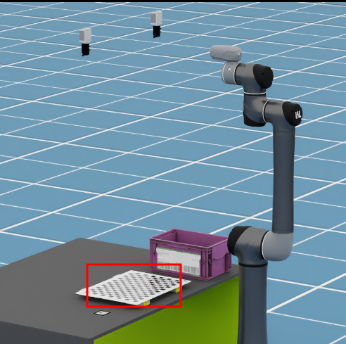
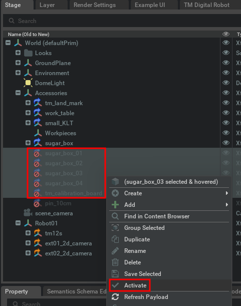
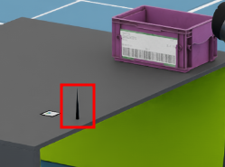
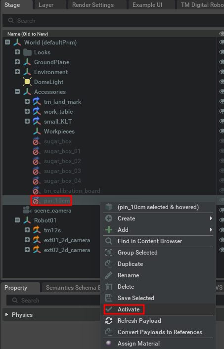
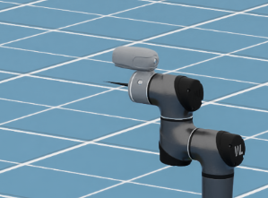
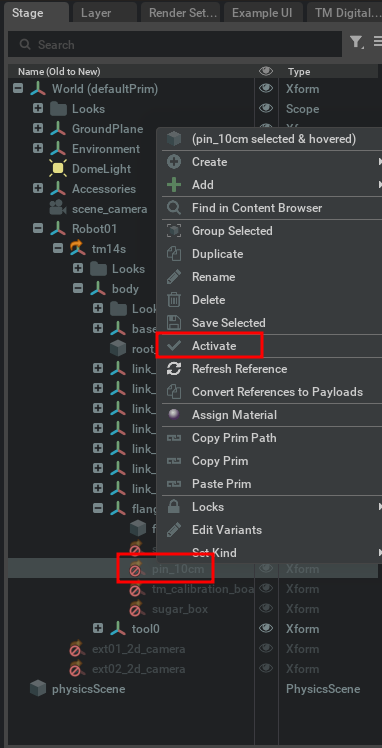
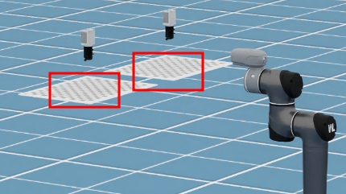
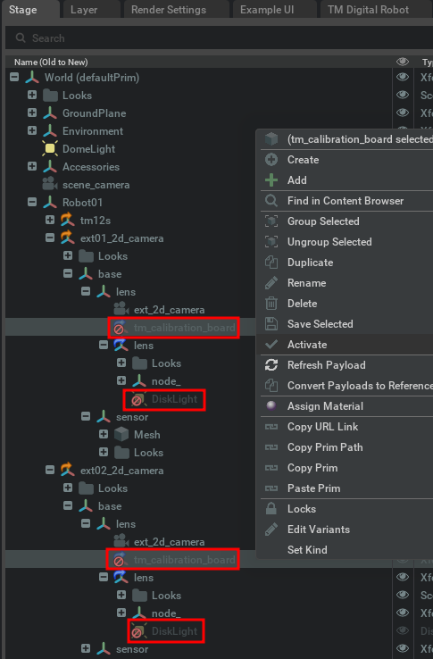
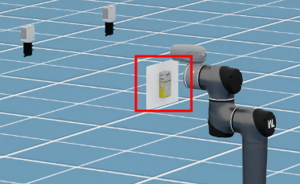
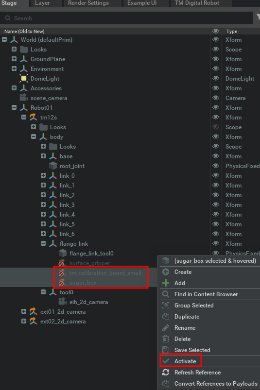

# Case 3: Collaboration Accessories

This case demonstrates how to activate various collaboration accessories for 2D Vision testing in Isaac Sim.

## Eye-in-Hand Camera Calibration Board

-   Location:

    

-   Activation:

    

## 10cm Pin on the desk

-   Location:

    

-   Activation:

    

## 10cm Pin attached to the flank of the robot

-   Location:

    

-   Activation:

    

## Eye-to-Hand Camera Calibration Board

-   Location:

    

-   Activation:

    

-   Note: The DiskLight is optional; it illuminates the calibration board in the dark.

## Up-Looking Camera Calibration Board

-   Location:

    

-   Activation:

    
