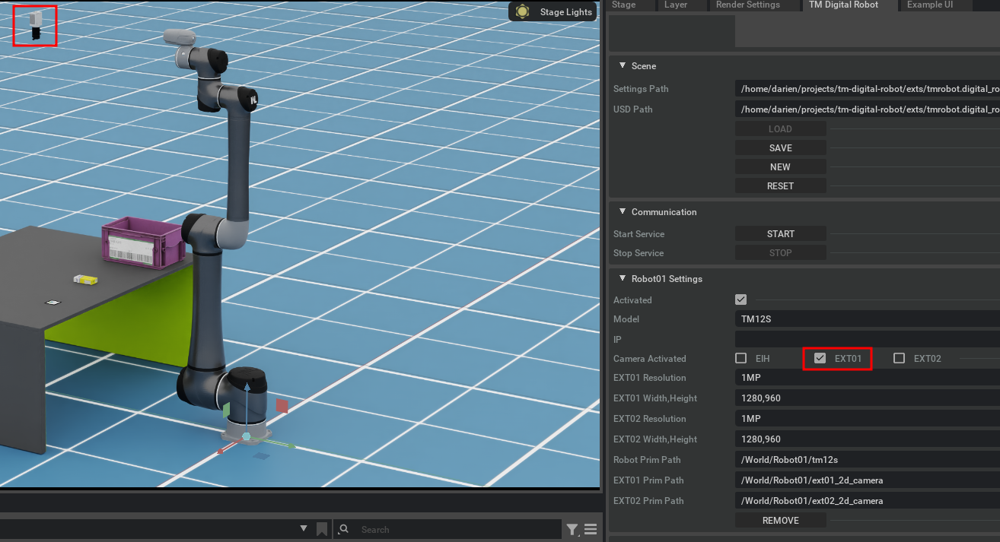
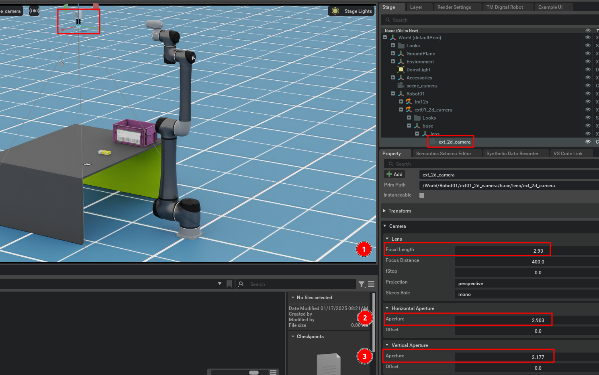
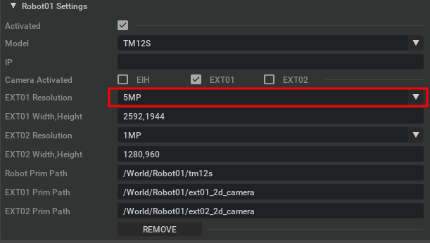

# Case4: FOV Settings of External Camera

This guide explains how to configure the Field of View (FOV) settings for an external (EXT) camera in Isaac Sim, making the simulation align with real-world camera specifications.

## Purpose

When using an external camera, it’s essential to set the FOV based on the real camera's lens and sensor specifications to ensure realistic 2D vision testing.

### Example Specifications

If you are using a camera with the following specifications:

#### Lens

-   **Focal Length:** 2.93 mm

#### Sensor

-   **Size:** 2.903 mm × 2.177 mm
-   **Resolution:** 2448 px × 2048 px

### Steps to Configure

1. **Activate the External Camera (EXT01):**
   

2. **Set Camera Properties:**

    - Go to the **Stage** tab.
    - Select the `ext_2d_camera` (EXT01) as shown below.
    - Update the settings:
        - 1 . **Focal Length:** 2.93 mm
        - 2 . **Horizontal Aperture (Sensor Width):** 2.903 mm
        - 3 . **Vertical Aperture (Sensor Height):** 2.177 mm
          

3. **Adjust Resolution:**
    - Open the **Extension UI**.
    - Select **5MP** from the EXT01 **Resolution** dropdown.
      

### Final Outcome

The virtual camera is now configured to match the real camera's specifications, ensuring accurate FOV and resolution for realistic simulations.
