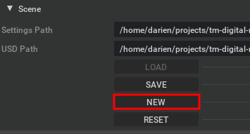
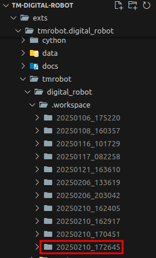
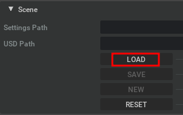
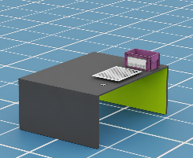
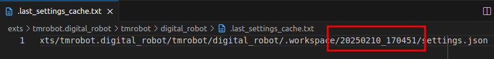
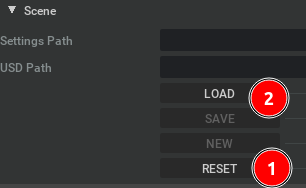

# Case 5: Understand the Create and Switch Scene

## How to Create a New Scene

-   To create a new scene, click **NEW**. The current scene will be saved, and a new scene will be created.

    

-   The new scene is generated in the `.workspaces` folder with the name format `YYYYMMDD_HHMMSS`. You can find it in the following path:

    ```bash
    ~/projects/tm-digital-robot/exts/tmrobot.digital_robot/tmrobot/digital_robot/.workspace
    ```

-   The folder structure appears as follows, where the last folder represents the newly created scene:

    

-   Click **LOAD** to load the new scene.

    

-   The default scene is then loaded.

    

## Understanding the Cache File for Tracking the Current Editing Scene

-   A cache file keeps track of the current editing scene. You can find it at:

    ```bash
    ~/home/darien~/projects/tm-digital-robot/exts/tmrobot.digital_robot/tmrobot/digital_robot/.last_settings_cache.txt
    ```

-   The folder name stored in `last_settings_cache.txt` represents the currently edited scene.

    

### How to Switch to an Edited Scene

-   To switch to a different scene, modify the folder name in `.last_settings_cache.txt` and save the file.

-   Then, click **RESET** and **LOAD**. The scene will be updated accordingly.

    
