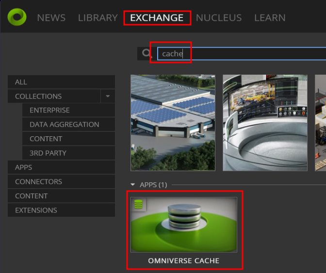
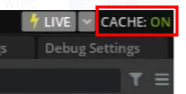
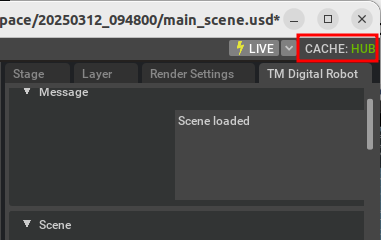

# Installation of Cache

If you experience poor performance during simulation, installing Cache is recommended to significantly improve Isaac Sim's performance.

## Types of Cache Services in Omniverse

There are two types of Cache services available in Omniverse:

### 1. [Cache on Workstation](https://docs.omniverse.nvidia.com/utilities/latest/cache/workstation.html)

This method requires installing Cache via the Omniverse Launcher. You should find it displayed as shown below:

You can download the Omniverse Launcher from the [NVIDIA Omniverse for Developers](https://developer.nvidia.com/omniverse?sortBy=developer_learning_library%2Fsort%2Ffeatured_in.omniverse%3Adesc%2Ctitle%3Aasc#section-getting-started) page.

After installing Cache, **CACHE NO** should appear in the top-right corner of the window.

**NOTE:** The Omniverse Launcher will be deprecated on October 1, 2025.

### 2. [Hub Workstation Cache](https://docs.omniverse.nvidia.com/utilities/latest/cache/hub-workstation.html)

The Hub Workstation Cache will replace Cache on Workstation.

After installing the Hub Workstation Cache, **CACHE HUB** should appear in the top-right corner of the window.

