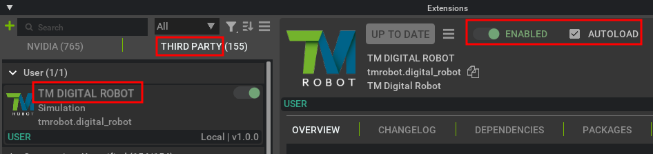

# Installation of TM Digital Robot Extension

-   Start Isaac Sim.
-   Open **Window -> Extensions** from the top menu.
-   Click the hamburger icon -> **Settings** to access **Extensions Search Paths**.

    

-   Click **Add**, input the path where TM Digital Robot Extension is cloned, and ensure it ends with **/exts**.

    -   Example for Windows:

        

    -   Example for Ubuntu:

        

-   Go to the **THIRD PARTY** tab, find **TM Digital Robot Extension**, toggle **ENABLED**, and enable **AUTOLOAD**.

    

-   A new **TMRobot** menu will appear. Click **TM Digital Robot** to open the extension.

    

-   Drag and dock the extension to the right side for easy access.

    

-   Installation is complete.

## Next step

-   Next, please go to [Setup TMSimulator](SETUP_TMSIMULATOR.md) for the following step
