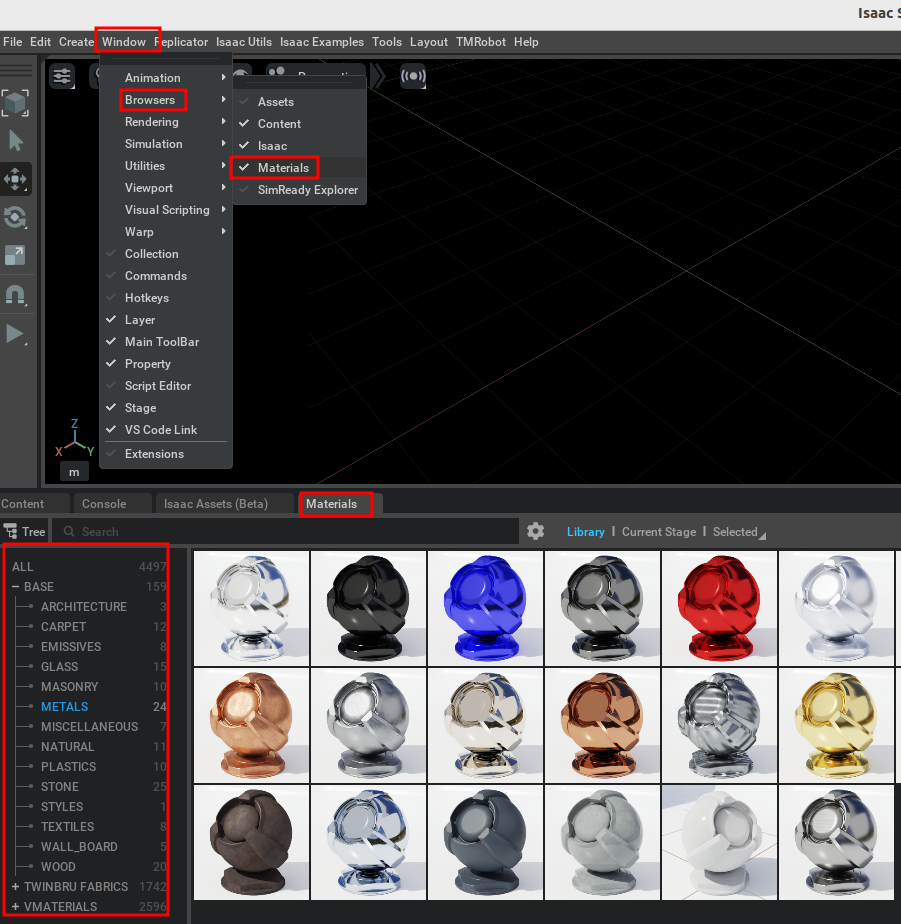
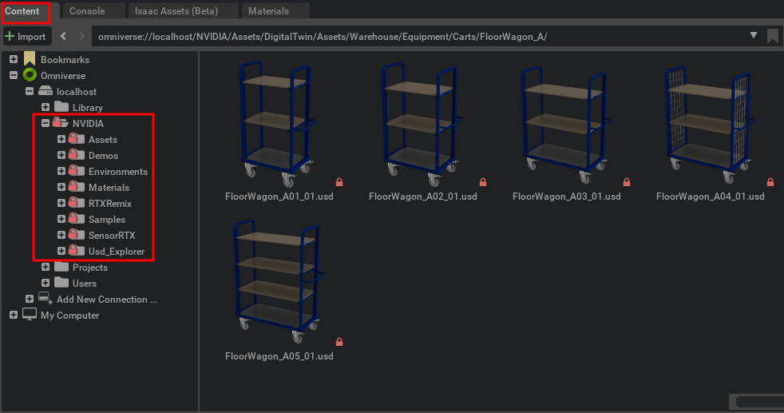

# Install Nucleus Workstation (Optional)

To create scenes and import 3D CAD (STEP) as USD, you may want to apply materials to make them more realistic. The Nucleus Workstation offers many materials and 3D assets for scene decoration.

-   To install Nucleus Workstation by Omniverse, follow the official link:

    [Nucleus Workstation Installation](https://docs.omniverse.nvidia.com/nucleus/latest/workstation/installation.html)

-   After installation, you can browse materials in the menu shown below:

    

-   Find plenty of 3D assets in the Content Browser:

    