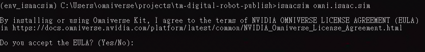

# Isaac Sim Installation guide for Windows

## Download the TM Digital Robot Extension

```bash
mkdir %USERPROFILE%\projects
cd %USERPROFILE%\projects
git clone https://github.com/TechmanRobotDev/tm-digital-robot-publish
cd %USERPROFILE%\projects\tm-digital-robot-publish
```

-   Please checkout the latest or specific version and then create new branch for your custom development
-   Checkout the latest version, you can use the command below

```bash
git checkout v2.22.12
git branch v2.22.11_custom
git checkout v2.22.11_custom
```

## Make sure you have Python 3.10 installed

-   please use command below to check if you have Python 3.10.xx installed

```bash
python --version
```

-   below is the example of the output if you have Python 3.10 installed

    

## Install the Isaac Sim

### Create a virtual environment

```bash
cd %USERPROFILE%\projects\tm-digital-robot-publish
python3.10 -m venv env_isaacsim
env_isaacsim\Scripts\activate
python.exe -m pip install --upgrade pip
```

### Install Isaac Sim - Python packages

```bash
pip install isaacsim==4.2.0.2 --extra-index-url https://pypi.nvidia.com
```

### Install Isaac Sim - Python packages cached extension dependencies

```bash
pip install isaacsim-extscache-physics==4.2.0.2 isaacsim-extscache-kit==4.2.0.2 isaacsim-extscache-kit-sdk==4.2.0.2 --extra-index-url https://pypi.nvidia.com
```

**HINT**: If you encounter issues of **this system does not have Windows Long Path support enabled**, please refer to [Enable long paths in Windows 10, version 1607, and later](https://learn.microsoft.com/en-us/windows/win32/fileio/maximum-file-path-limitation?tabs=powershell#enable-long-paths-in-windows-10-version-1607-and-later) to solve the issue.

### Install other required packages

```bash
pip install -r requirements.txt
```

### Start Isaac Sim

-   Make sure you are in the virtual environment env_isaacsim

```bash
cd %USERPROFILE%\projects\tm-digital-robot-publish
env_isaacsim\Scripts\activate
```

-   Start Isaac Sim by command below

```bash
isaacsim omni.isaac.sim
```

-   You will see the License Agreement at the first time you start Isaac Sim, key in `y` if you agree with the License Agreement

    

-   After while, you will see the Isaac Sim window

    

-   If you can see the Isaac Sim window, it means you have successfully installed Isaac Sim.

-   It's good idea to create a shortcut named isaacsim.bat for the Isaac Sim on your desktop for easy access, please copy the script below and save it as isaacsim.bat

    

    ```bash
    @echo off
    cd %USERPROFILE%\projects\tm-digital-robot-publish
    call env_isaacsim\Scripts\activate
    isaacsim omni.isaac.sim
    pause
    ```

## Open the source code by Visual Studio Code

-   Open your source code by command below

```bash
cd %USERPROFILE%\projects\tm-digital-robot-publish
code .
```

-   You should see the Visual Studio Code window with the source code, the extension.py that allows you customize as you need

    

## Next step

-   Next, please go to [Installation of TM-Digital Robot Extension](INSTALL_EXTENSION.md) for the following step
