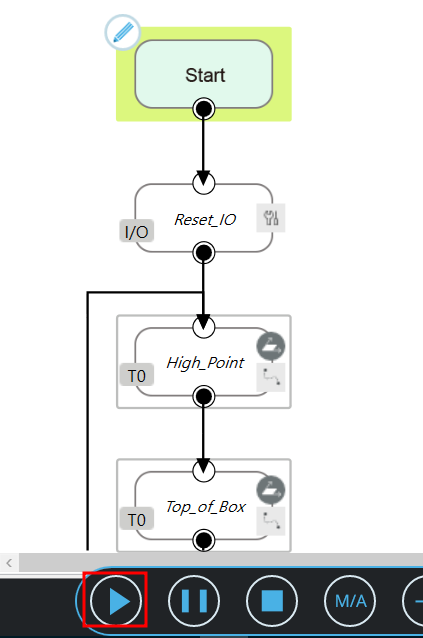
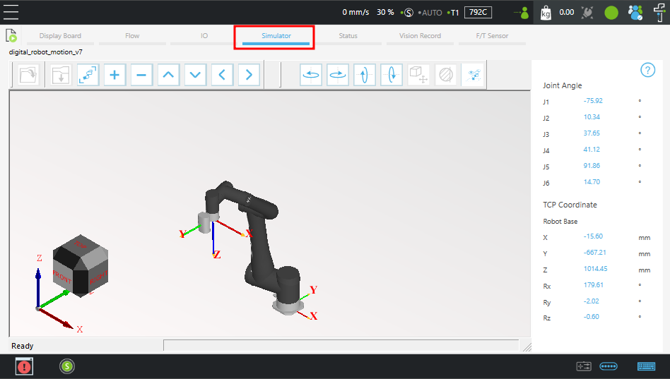
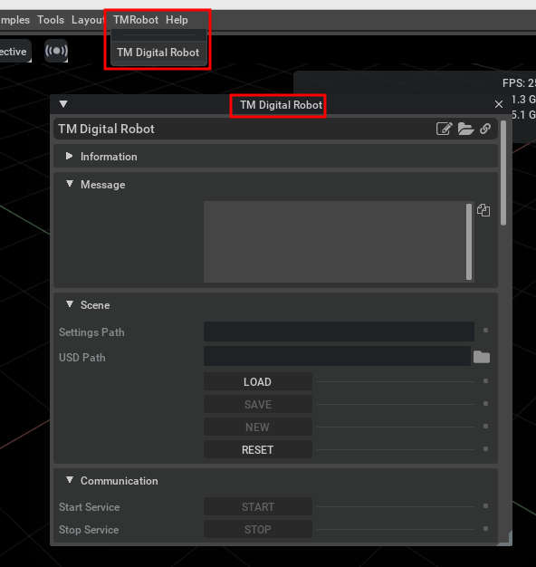
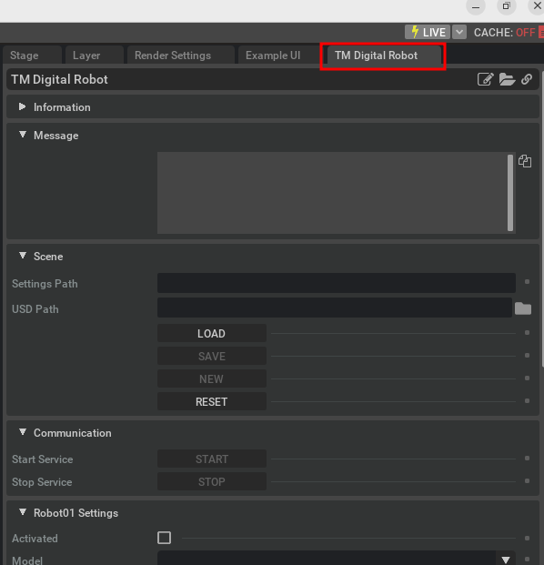

# Simulate with sample project - motion synchronization

Now you can run the sample project to synchronize motion between TMRobot and Isaac Sim, please follow the steps below:

## In TMSimulator

-   Play the sample project in TMSimulator.

    

-   Make sure the robot is moving in tab **Simulator**.

    

## In Isaac Sim

-   Open the **TM Digital Robot** extension from top menu **TMRobot -> TM Digital Robot**.

    

-   It's good idea to dock the extension to the right side for easy access.

    

## Simulate with sample project - digital Output/Inputs
