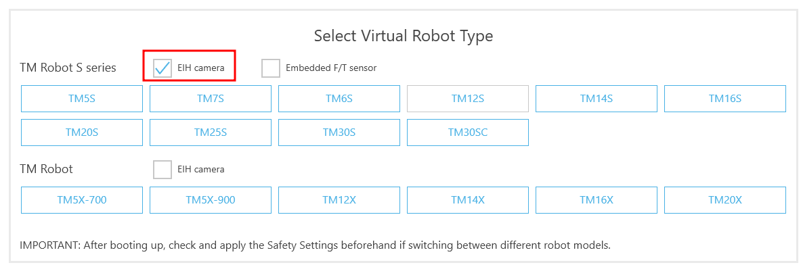
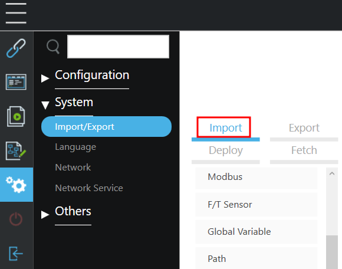
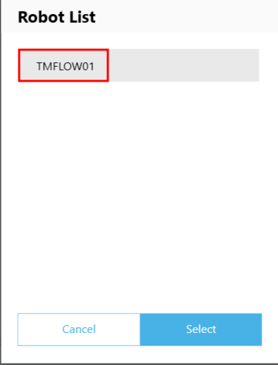
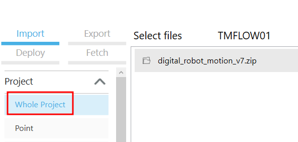
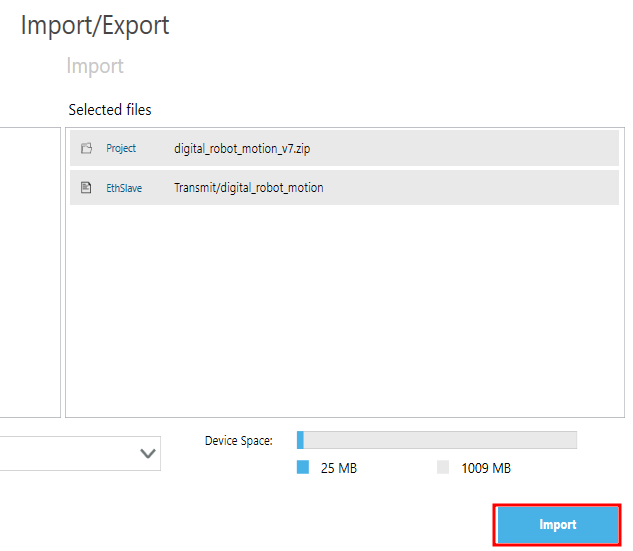
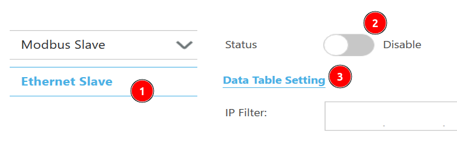
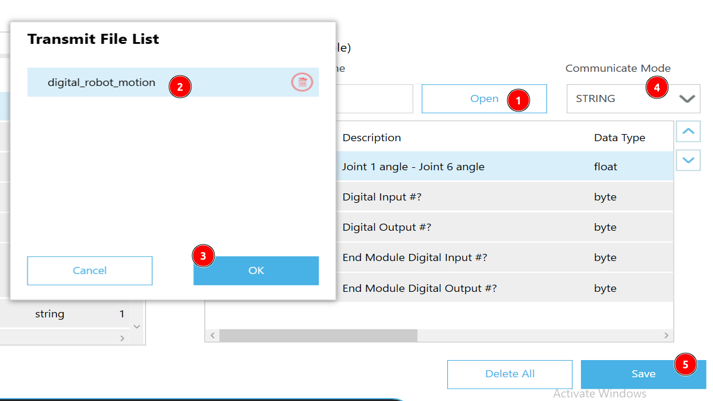
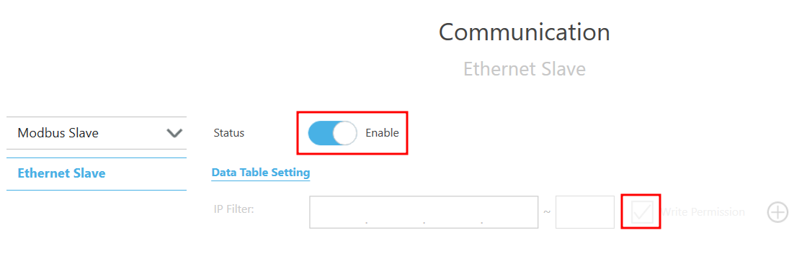
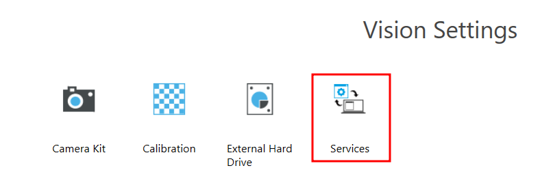
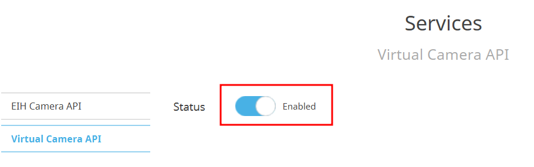

# Setup TMSimulator

Before running the sample project, you need to set up TMSimulator to communicate with Isaac Sim, please follow the steps below:

-   Launch TMSimulator(TMflow), tick **EIH Cameras** and click one of S series robot model in the **Select Virtual Robot Type** window.
-   **Current Supported Robots**: TM5S, TM7S, TM6S, TM12S, TM14S, TM16S,TM20S, TM25 and TM30S

    

## Import Sample Project and Configure Ethernet

-   Copy the **TM_Export** folder to a USB named **TMROBOT**.
-   Insert the USB into the PC running TMSimulator.
-   Navigate to **gear icon -> System -> Import/Export**, then click **Import**.

    

-   Select **TMFLOW01** from the Robot List and click **Select**.

    

-   Click Import tab and then click by step below:

    -   **Project -> Whole Project**: Choose **digital_robot_motion_v7.zip**.

        

    -   **Configuration -> Ethernet Slave**: Choose **Transmit/digital_robot_motion**.

        

-   Ensure the project and Ethernet Slave are selected on the right and click **Import**.

    

## Enable Ethernet Slave Communication

-   Go to **gear icon -> Configuration -> Communication**, then click **Ethernet Slave**.
-   Disable **Ethernet Slave**, then click **Data Table Setting**.

    

-   In **Data Table Setting**:

    -   Click **Open** and select **digital_robot_motion**.
    -   Set **Communication Mode** to **STRING**.
    -   Save the settings.

    

-   Return to the **Communication** window, enable **Write Permission**, and toggle **Status** to **Enable**.

    

## Enable Virtual Camera API

**Notes**: This step is only for TMSimulator, if you are using TMFlow with a physical robot, you can skip this step.

-   Go to **gear icon -> Configuration -> Vision Settings**, then click **Services**.

    

-   In **Virtual Camera API**, toggle **Status** to **Enabled**.

    

Setup is now complete.
