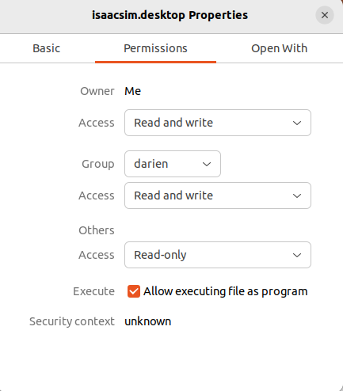

# Ubuntu Tips

## Install NVIDIA driver

-   Install driver

```bash
sudo add-apt-repository ppa:graphics-drivers/ppa
sudo apt update
sudo apt install nvidia-driver-535
```

-   Reboot

```bash
sudo reboot
```

-   Check the driver version

```bash
nvidia-smi
```

## Installing required development tools

```bash
sudo apt update
sudo apt install -y git
sudo apt install -y python3.10 python3.10-venv
sudo apt install -y python-is-python3
```

## Make icons for desktop applications

-   Create isaacsim.sh on the desktop

```bash
#!/bin/bash
cd ~/projects/tm-digital-robot
source env_isaacsim/bin/activate
isaacsim omni.isaac.sim
```

-   Create isaacsim.desktop

```bash
[Desktop Entry]
Name=isaacsim
Comment=Isaac Sim
Exec=/home/darien/Desktop/isaacsim.sh
Terminal=true
Type=Application
Categories=Utility;
```

-   Set permissions with desktop file



-   Right-click on the desktop file and select **allow launching**.
